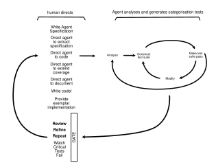

# Low-latency .NET - migrating a C++ matching engine to C# using agentic ATDD

## A spike to port a C++ trading engine to zero-allocation .NET, with Native AOT benchmarking

### .NET in the modern HFT ecosystem

Over the past decade, the architecture of high-frequency trading systems has fundamentally changed. The sub-microsecond "tick-to-trade" path has moved off the CPU to the FPGA, and software remaining on the CPU receives data streams via kernel bypass (e.g., `Solarflare OpenOnload` / `DPDK`) to route network packets directly into user-space memory.

Behind this raw byte layer, front- and middle-office systems process millions of events per second, with confirmed transactions streaming en masse to post-trade and clearing services.

As regulatory mandates like SEC T+1 and CSDR push risk, confirmation and reporting pipelines from batch to real-time, non-negotiable delivery windows present critical throughput and reliability challenges across the trade lifecycle.

### Enter low-latency .NET

While FPGAs and specialized C++ remain standard on the absolute *tick-to-trade* path, modern .NET is a compelling choice for surrounding real-time workloads - delivering sub-microsecond, low-jitter throughput directly on pinned silicon.

#### Runtime and OS primitives

* **Low-Level Memory:** `Span<T>` and `System.IO.Pipelines` enable zero-allocation buffer slicing over user-space network ring buffers.
* **Native AOT:** Compiles C# directly to static machine code, removing runtime JIT warm-up spikes and reflection overhead.
* **OS Alignment:** Integrates seamlessly with Linux core isolation (`isolcpus` / `nohz_full`) and thread affinity to eliminate OS context-switching jitter.

#### Java ecosystem parity

C# offers Java-level enterprise integration, with superior memory ergonomics, e.g. -

* `Confluent.Kafka` wraps `librdkafka` - socket I/O and buffering execute in unmanaged memory, delivering near-native C throughput via async C# APIs.
* gRPC & Binary Framing (`Grpc.AspNetCore` / `Grpc.Net.Client`) maintained by Microsoft, leverages `System.IO.Pipelines` and `Span<T>` to decode binary Protobuf frames directly from sockets, with zero heap allocations.

---

### An agent-assisted C++ porting experiment

Our experiment here is somewhat ideal, as we start with C++ [source code](https://github.com/PacktPublishing/Building-Low-Latency-Applications-with-CPP) taken from Sourav Ghosh's *[Building Low Latency Applications with C++](https://amzn.to/3RMQZOO)* book.

Ghosh's C++ architecture relies on custom memory pools, doubly-linked price level queues, and lock-free Single-Producer Single-Consumer (SPSC) ring buffers to process price-time priority (FIFO) order matching without OS thread locks.

#### The translation strategy

Rather than writing idiomatic, allocation-heavy C#, we applied **mechanical sympathy** to the .NET runtime:

1. **Hardware cache isolation:** We padded sequences using `[StructLayout(LayoutKind.Explicit)]` to 128 bytes—providing native cache line isolation on ARM64 Apple Silicon (128B) and double-line padding on x86_64 Intel Xeon (64B) to neutralize L2 spatial/adjacent-line prefetching across cores.
2. **Power-of-two masking:** Replaced modulo division (`% capacity`) with single-cycle bitwise `AND` masking (`sequence & mask`).
3. **Zero-allocation data payloads:** Replaced heap-allocated strings and objects with fixed-width `readonly struct` definitions.


```csharp
// Example: Cache-line padded lock-free sequence in C# (.NET 10)
[StructLayout(LayoutKind.Explicit, Size = 128)]
public struct PaddedSequence
{
    [FieldOffset(0)]
    public volatile long Value;
}
```

---

### Benchmarks

Using **BenchmarkDotNet** (`[MemoryDiagnoser]`), initially on an Intel Xeon W-3245 workstation running Native AOT, we measured the execution speed and memory allocations of the C# implementation:

| Benchmark method | Mean latency | Throughput (ops/sec) | Ratio vs SPSC | Allocated memory |
| --- | --- | --- | --- | --- |
| `SpscRingBuffer_PushAndPop` | 2.054 ns | 486,854,917 ops/sec | 1.00 (Baseline) | 0 B |
| `ConcurrentQueue_PushAndPop` | 12.252 ns | 81,619,327 ops/sec | 5.97x slower | 0 B |
| `SystemThreadingChannel_PushAndPop` | 45.225 ns | 22,111,663 ops/sec | 22.02x slower | 0 B |
| `DecodeAndEnqueueBinaryFrame` (Gateway) | 4.361 ns | 229,305,205 ops/sec | — | 0 B |
| `MatchOrderPair` (Matching Engine) | 40.680 ns | 24,582,104 pairs/sec <br> <br> *(49,164,208 orders/sec)* | — | 0 B |

#### Key takeaways:

* **2.054 nanoseconds:** The C# lock-free ring buffer executes a full push-and-pop in **~6 CPU clock cycles**, outperforming standard `ConcurrentQueue` by **6x** and `System.Threading.Channels` by **22x**.
* **40.68 nanoseconds:** The C# FIFO matching engine matches a complete Buy/Sell order pair in RAM (**~130 CPU clock cycles**) at a rate of **24.58 million matched pairs per second**.
* **0 bytes allocated:** Managed heap allocations across the entire hot path were exactly **0.00 B**, completely eliminating Garbage Collector pauses.

---

### ATDD pairing with an agentic test engineer

The ATDD cycle is well-known to teams working in risk-focused environments, where Continuous Delivery and mainline development have long been standard baseline practices.

In agent-assisted development, we gain analytical and code coverage superpowers. In this experiment, I've let the agent independently port the C++ source and add coverage, performing *all of the ATDD flow*, but with a directive to stop and permit review in a step-by-step fashion - this allows us to align behaviour, coding style, provide examples, and also ask questions as we go!


*Figure 1: An agentic code migration and test generation cycle (not meant to be definitive!).*

This approach isn't going to fly in more critical environments, but even on a simple codebase, it does result in a strange feeling of disconnection from the *psychological flow* inherent in TDD; not being inside the *red-green-refactor* loop, we perhaps don't establish the same level of ***trust*** in tests and specification.

On the upside, this probably means we must mitigate risks with a closer adherence to formal rigor, which cannot be a bad thing in ultraquality systems. We delve into property-based testing and multithreading (Coyote), below.

In this experiment, this is very simple code. We aren't dealing with deeper state spaces, a myriad of concurrent conditions, or replay idempotency (TODO: double check whether the network card will ever send duplicate packets... 😂). It's a very simple, deterministic process.

#### Establishing baseline agent rules - asking the agent to train itself

The *LMAX Disruptor* architecture is well-known - in 2011, it established the foundations for low-latency in Java. By eliminating high-cost runtime operations like garbage collection, context switching and thread synchronisation, a single uninterrupted CPU thread can achieve impressive throughput.

So, I asked ***Google Gemini*** *"Can we construct an automated, zero-allocation test harness, directly in C#, without relying on heavy external profiling tools?"*

The response outlined techniques that need to be applied, and this became the [initial commit into the spike repo](https://github.com/kennymac/low-latency-csharp-exchange/blob/8e5ac25ba99ca944b56d8f173e18758339a34a2a/TestHarness/TestHarness.UnitTests/TestHarness/readme.md).

Here's an example unit test that asserts zero bytes have been allocated to the current thread - this becomes a zero-allocation regression safety gate in CI/CD:

```csharp
[Fact]
public void OrderExecution_MustBeZeroAllocation()
{
    // 1. Warm-up & clear transient setup memory
    var engine = new MatchingEngine();
    engine.ExecuteOrder(101, 150.50m, 100);
    GC.Collect();
    GC.WaitForPendingFinalizers();

    // 2. Capture baseline
    long bytesBefore = GC.GetAllocatedBytesForCurrentThread();

    // 3. Execute hot-path logic
    engine.ExecuteOrder(102, 150.55m, 200);

    // 4. Assert zero allocations
    long bytesAfter = GC.GetAllocatedBytesForCurrentThread();
    Assert.Equal(0, bytesAfter - bytesBefore);
}
```

The next step was to direct *Google Antigravity* to the local copy of the spike repo, and ask it to formulate its own rules, based upon the approach Gemini outlined. This became [`.antigravity/rules.md`](https://github.com/kennymac/low-latency-csharp-exchange/blob/main/.antigravity/rules.md).

Next, we pointed Antigravity at the C++ source code, and asked it to formulate a step by step plan to translate the repo into C#, working component by component, and pausing step by step, so that generated code and tests could be reviewed. Also, at each step, we'd ask Antigravity to explain techniques.

At the end of each step, we review, ask for clarification (adding notes into the [`/Documentation`](https://github.com/kennymac/low-latency-csharp-exchange/tree/main/Documentation) folder), run tests green and commit.

---

### Step-by-step walkthrough

#### Step 1: Migrate the core matching engine [[view](https://github.com/kennymac/low-latency-csharp-exchange/commit/59daf99a8c7055b1a43db59d7d0b5d07b6b1e8ae)]

The core `OrderBook` class was translated from C++ to C#. To ensure zero-allocation execution and priority correctness, covering unit tests were introduced in [`OrderBookTest.cs`](https://github.com/kennymac/low-latency-csharp-exchange/blob/main/LowLatency.ScratchPad.MatchingEngine.UnitTests/OrderBookTest.cs), testing limit order placement, FIFO price/time priority matching, order cancellations, partial vs. full fills, and in-process zero-allocation assertions.

##### Q. How do we feed signals into the app or probe a running console app? [[view](https://github.com/kennymac/low-latency-csharp-exchange/blob/main/Documentation/00%20How%20To%20Feed%20Signals%20Into%20the%20App%20or%20Probe%20a%20running%20console%20app.md)]

Compares signal ingress models (SPSC lock-free queues vs. direct callback loops) and details engine probing mechanisms via in-process signal generators, memory-mapped files (`MemoryMappedFile`), and binary UDP sockets.

##### Q. How do producers and consumer apps running on different cores intercommunicate using the buffer? Explain use of volatile [[view](https://github.com/kennymac/low-latency-csharp-exchange/blob/main/Documentation/01%20Memory%20Coherence%20Volatile%20and%20Lock-Free%20Ring%20Buffer%20Hardware%20Architecture.md)]

Analyzes CPU hardware execution across dual cores, private L1/L2 caches, cache line boundaries, memory ordering, and how `Volatile.Write`/`Volatile.Read` emit store/load fences and trigger MESI cache invalidation.

##### Q. How do we create zero-allocation unit tests without heavyweight test harnesses? [[view](https://github.com/kennymac/low-latency-csharp-exchange/blob/main/Documentation/02%20How%20To%20Create%20Low%20Latency%20Unit%20Tests%20Without%20Heavyweight%20Test%20Harnesses.md)]

Formulates the in-process zero-allocation unit testing pattern using `GC.GetAllocatedBytesForCurrentThread()`, enforcing mandatory JIT warm-up cycles, single-threaded context isolation, and clean GC baselines.

#### Step 2: Migrate the lock-free SPSC ring buffer [[view](https://github.com/kennymac/low-latency-csharp-exchange/commit/18e504788c130b58a560ae46eac524883b63bc38)]

The `SpscRingBuffer` component was implemented using lock-free single-producer single-consumer mechanics and hardware cache alignment. Unit tests were added in [`SpscRingBufferTest.cs`](https://github.com/kennymac/low-latency-csharp-exchange/blob/main/LowLatency.ScratchPad.MatchingEngine.UnitTests/SpscRingBufferTest.cs) to verify enqueue/dequeue correctness, power-of-two capacity validation, Disruptor batch processing (`TryDequeueBatch`), full/empty boundary wrap-around, zero-allocation assertions, and structural alignment verification via `Marshal.OffsetOf`.

##### Explain how we are applying the LMAX Disruptor architecture to C# [[view](https://github.com/kennymac/low-latency-csharp-exchange/blob/main/Documentation/03%20LMAX%20Disruptor%20Architecture%20and%20Mechanical%20Sympathy%20in%20CSharp.md)]

Explores LMAX Disruptor principles, write contention bottlenecks, batching mechanics, and pre-allocated bounded ring buffers.

##### Explain the CPU costs of division, and how modulo division (bit masking) is used in the ring buffer [[view](https://github.com/kennymac/low-latency-csharp-exchange/blob/main/Documentation/04%20Power%20of%20Two%20Bitwise%20Masking%20vs%20Modulo%20Division.md)]

Breaks down CPU cycle costs (`and` [1 cycle] vs. `idiv` [10–30 cycles]), demonstrating how power-of-two capacities enable sequence wrapping via bitwise AND (`sequence & mask`).

##### Explain how Struct memory layout padding gives us optimum cache line alignment in C# [[view](https://github.com/kennymac/low-latency-csharp-exchange/blob/main/Documentation/05%20Cache%20Line%20Padding%20and%20StructLayout%20Memory%20Alignment%20in%20CSharp.md)]

Explains false sharing elimination, showing how `[StructLayout(LayoutKind.Explicit, Size = 256)]` pads head/tail cursors with 128 bytes to isolate cache lines across Apple Silicon (128B) and Intel Xeon (64B) cores, with programmatic unit test verification using `Marshal.OffsetOf`.

#### Step 3: Asynchronous outbound event emission and disk journaling [[view](https://github.com/kennymac/low-latency-csharp-exchange/commit/ea63352b140b7e90c98b0615b6530820f5afd724)]

The `LowLatencyLogger` asynchronous disk journaler was implemented to isolate the matching core from disk and network I/O. Unit tests in [`LowLatencyLoggerTest.cs`](https://github.com/kennymac/low-latency-csharp-exchange/blob/main/LowLatency.ScratchPad.MatchingEngine.UnitTests/LowLatencyLoggerTest.cs) verify asynchronous disk journaling, lock-free log event queueing, thread-isolated string formatting, and zero-allocation emission on hot paths.

##### Explain event emission and outbound ring buffer architecture in low latency engines [[view](https://github.com/kennymac/low-latency-csharp-exchange/blob/main/Documentation/06%20Event%20Emission%20and%20Outbound%20Ring%20Buffer%20Architecture%20in%20Low%20Latency%20Engines.md)]

Outlines thread isolation architecture separating the matching core from blocking I/O (disk streams, network sockets, string formatting). Details the three outbound SPSC ring buffer channels (`ClientResponse`, `MarketUpdate`, `LogEntry`) pushing struct payloads to dedicated consumer threads.

#### Step 4: Binary network protocol and client gateway [[view](https://github.com/kennymac/low-latency-csharp-exchange/commit/1deff0c4aba8319895ad2a7aec93409ed4691292)]

The `OrderServer` client gateway and 32-byte binary request protocol were implemented. Covering unit tests in [`OrderServerTest.cs`](https://github.com/kennymac/low-latency-csharp-exchange/blob/main/LowLatency.ScratchPad.MatchingEngine.UnitTests/OrderServerTest.cs) assert 32-byte fixed binary packet deserialization, `Span<byte>` zero-copy struct casting via `MemoryMarshal.Read<ClientRequest>`, gateway ring buffer enqueueing, and zero-allocation execution.

##### Q. Is the binary network protocol representative of SBE vs FIX in high frequency trading [[view](https://github.com/kennymac/low-latency-csharp-exchange/blob/main/Documentation/07%20Binary%20Network%20Protocols%20and%20SBE%20vs%20FIX%20in%20High%20Frequency%20Trading.md)]

Compares high-overhead ASCII FIX text protocols (~2,000ns parse time) against fixed binary wire formats (NASDAQ OUCH 5.0 / CME SBE). Details direct memory access (DMA) kernel-bypass packet ingestion and the 32-byte binary `ClientRequest` struct specification.

#### Step 5: Micro-benchmarking harness and Native AOT compilation [[view](https://github.com/kennymac/low-latency-csharp-exchange/commit/2746706da6874204bf9ebb960ea1e2e8237e9a04)]

A BenchmarkDotNet profiling suite (`MatchingEngineBenchmark.cs`, `OrderServerBenchmark.cs`, `SpscRingBufferBenchmark.cs`) was created with `[MemoryDiagnoser]` to measure nanosecond latencies and enforce a strict `0.00 B` managed heap allocation policy under Native AOT compilation. *(Note: While `<PublishAot>true</PublishAot>` is enabled for the core engine project `Engine.csproj`, Native AOT is disabled on the BDN host runner project because `CommandLineParser` relies on reflection metadata that trimming strips out.)*

##### BenchmarkDotNet profiling harness and allocation verification in C# [[view](https://github.com/kennymac/low-latency-csharp-exchange/blob/main/Documentation/08%20BenchmarkDotNet%20Profiling%20Harness%20and%20Allocation%20Verification%20in%20CSharp.md)]

Presents BenchmarkDotNet cross-architecture throughput tables, enforcing `0.00 B` memory allocation policies and explaining high-priority process permissions on macOS/Linux.

##### Native AOT compilation and bare metal C# performance [[view](https://github.com/kennymac/low-latency-csharp-exchange/blob/main/Documentation/09%20Native%20AOT%20Compilation%20and%20Bare%20Metal%20CSharp%20Performance.md)]

Explains how Native AOT compilation (`<PublishAot>true</PublishAot>`) eliminates RyuJIT compilation tiering jitter, cold-start delays, and runtime metadata overhead, publishing self-contained bare-metal executables across macOS (ARM64/x64) and Linux x64.

#### Step 6: Multi-hardware microarchitecture profiling [[view](https://github.com/kennymac/low-latency-csharp-exchange/commit/586eb1ff63d3a5884388b6fd363797e284372b16)]

Empirical multi-hardware benchmarks were run across Apple M3 Pro, Apple M1, and Intel Xeon W-3245 architectures to evaluate microarchitectural performance scaling and latency characteristics.

##### Hardware microarchitecture benchmark comparison Intel Xeon vs Apple M3 Pro vs Apple M1 [[view](https://github.com/kennymac/low-latency-csharp-exchange/blob/main/Documentation/10%20Hardware%20Microarchitecture%20Benchmark%20Comparison%20Intel%20Xeon%20vs%20Apple%20M3%20Pro%20vs%20Apple%20M1.md)]

Delivers empirical side-by-side performance benchmarks: SPSC ring buffer push/pop in **1.28 ns** (M3 Pro) vs **2.05 ns** (Xeon) vs **9.58 ns** (M1); wire decoding in **2.79 ns** (M3 Pro); order matching pair execution in **22.62 ns** (44.21M match pairs / 88.42M orders/sec on M3 Pro), confirming zero heap allocations across all three hardware targets.

#### Step 7: Idiomatic C# baseline and allocation contrast [[view](https://github.com/kennymac/low-latency-csharp-exchange/commit/234dbb2dd055326fb738bbb90954af9860dcd0f3)]

An idiomatic C# matching engine baseline (`IdiomaticMatchingEngine` and `IdiomaticOrderBook`) was created using standard managed object allocations (`List<T>`, heap class instances, LINQ). In [`IdiomaticOrderBookTest.cs`](https://github.com/kennymac/low-latency-csharp-exchange/blob/main/LowLatency.ScratchPad.IdiomaticEngine.UnitTests/IdiomaticOrderBookTest.cs), unit tests confirm that standard idiomatic C# allocates heap memory per order match pair (`bytesAllocated.Should().BeGreaterThan(0)`), contrasting with the zero-allocation performance of the low-latency implementation.

In contrast, with idiomatic C#, using `List<T>`, a passing assertion would be as follows (see [`IdiomaticOrderBookTest.cs`](https://github.com/kennymac/low-latency-csharp-exchange/blob/main/LowLatency.ScratchPad.IdiomaticEngine.UnitTests/IdiomaticOrderBookTest.cs%23L115)):

```csharp
bytesAllocated.Should().BeGreaterThan(0, "Idiomatic C# allocates heap objects per matched order pair.");
```

#### Step 8: Additional testing - Microsoft Coyote and property-based testing [[view](https://github.com/kennymac/low-latency-csharp-exchange/commit/6425689354e2726f3316822a86701a73dc9ca254)]

Additional testing tools were introduced to cover determinism and additional invariants.

Microsoft Coyote tests in [`SpscRingBufferCoyoteTest.cs`](https://github.com/kennymac/low-latency-csharp-exchange/blob/main/LowLatency.ScratchPad.CoyoteTests/SpscRingBufferCoyoteTest.cs) perform systematic concurrency exploration to catch inter-thread memory reordering race conditions.

[`SpscRingBufferPropertyTest.cs`](https://github.com/kennymac/low-latency-csharp-exchange/blob/main/LowLatency.ScratchPad.PropertyBasedTests/SpscRingBufferPropertyTest.cs) uses property-based testing to verify queue FIFO ordering invariants under arbitrary sequence streams.

#### Step 9: Systematic mutation testing and fault injection audit [[view](https://github.com/kennymac/low-latency-csharp-exchange/tree/watchfails)]

In the unmerged [`watchfails`](https://github.com/kennymac/low-latency-csharp-exchange/tree/watchfails) branch, a systematic fault injection audit was performed using Stryker.NET. To close coverage gaps, remediation unit tests were added to [`OrderBookTest.cs`](https://github.com/kennymac/low-latency-csharp-exchange/blob/watchfails/LowLatency.ScratchPad.MatchingEngine.UnitTests/OrderBookTest.cs) (`Add_GivenHighVolumeOrderCycle_ThenRecyclesPoolNodesWithoutLeaking`) and [`OrderServerTest.cs`](https://github.com/kennymac/low-latency-csharp-exchange/blob/watchfails/LowLatency.ScratchPad.MatchingEngine.UnitTests/OrderServerTest.cs) (`TryReceiveRequest_GivenUndersizedBinaryFrame_ThenReturnsFalse`, `TryReceiveRequest_GivenFullInboundBuffer_ThenReturnsFalse`), bringing mutation kill coverage to 100% (8/8).

##### Systematic mutation testing and fault injection audit [[view](https://github.com/kennymac/low-latency-csharp-exchange/blob/watchfails/Documentation/11%20Systematic%20Mutation%20Testing%20and%20Fault%20Injection%20Audit.md)]

Details 8 deliberate fault-injection mutations across bitmask calculations, capacity boundaries, memory pool node recycling, frame bounds checking, and memory barrier bypasses. Explores why traditional unit tests missed memory barrier bypasses (`Volatile.Write`) while **Microsoft Coyote** successfully caught inter-thread memory reordering faults, documenting how initial test coverage gaps were remediated to achieve 100% mutation kill coverage (8/8).

##### Watch test failures [[view](https://github.com/kennymac/low-latency-csharp-exchange/blob/watchfails/WatchTestFailures.md)]

Documents real-time test execution behavior and failure patterns during fault injection mutation runs.

---

### Conclusion: that was quick!

Aside from the positive performance benchmarks, it's nice to get some low-latency code happening in C#. It's a wonderful open-source language with a rich ecosystem.

In terms of agentic pairing - it was pleasing to get through Sourav Ghosh's engine in just over 4 hours! I was trying to be thorough, rather than go fast - I thought it might take me a few days!

#### Did I need to prep??

I prepped by refreshing my background knowledge of low-level concepts, listening to screen readers on my daily walk - and felt there might have been a few more areas I needed to revisit to see what developments have flown under my radar.

However, what was most interesting about the agent-assisted flow was that *I may not have needed to do any prep at all!* At each step of the way, I could ask questions like *"could you explain that concept in detail?"*, or *"aha, so the 128 padding aligns with the cache line size? What about other CPU architectures?"*

> *In this sense, the flow is very much like pair programming ("Do we need to add another test?", or "How on earth does that work?"), so I think the potential to learn by doing is the superpower of agent-assisted development.*

It's very powerful - in not much time at all, we have an ultraquality baseline - zero-allocation unit tests, property-based tests, and deterministic threading coverage using Microsoft Coyote!

#### References and further reading

* Building Low Latency Applications with C++: Develop a complete low latency trading ecosystem from scratch using modern C++, Sourav Ghosh [Amazon](https://amzn.to/3RMQZOO) | [Packt](https://www.packtpub.com/en-gb/product/building-low-latency-applications-with-c-9781837634477)
* Pro .NET Memory Management: For Better Code, Performance, and Scalability, Konrad Kokosa, Christophe Nasarre, Kevin Gosse [Website](https://prodotnetmemory.com/) | [Amazon](https://amzn.to/3S86gK7)
* LMAX Disruptor Architecture & Mechanics: [LMAX Exchange Disruptor Technical Documentation](https://lmax-exchange.github.io/disruptor/)
* `Span<T>` Architecture & Mechanics: [MSDN: All About Span — Stephen Toub (2018)](https://learn.microsoft.com/en-us/archive/msdn-magazine/2018/january/csharp-all-about-span-exploring-a-new-net-mainstay)
* .NET Core 2.1 Foundations (`Span<T>` & `Pipelines`): [.NET Core 2.1 Performance Improvements](https://devblogs.microsoft.com/dotnet/performance-improvements-in-net-core-2-1/)
* Native AOT & Zero-JIT Latency (.NET 8): [.NET 8 Native AOT Benchmarks](https://devblogs.microsoft.com/dotnet/performance-improvements-in-net-8/#native-aot)
* Runtime & Memory Optimizations (.NET 9): [.NET 9 Performance Improvements](https://devblogs.microsoft.com/dotnet/performance-improvements-in-net-9/)
* Next-Gen Low-Latency Enhancements (.NET 10): [.NET 10 Performance Improvements](https://devblogs.microsoft.com/dotnet/performance-improvements-in-net-10/)
* Linux CPU Core Isolation Mechanics (`isolcpus` / `nohz_full`): [Linux Kernel Documentation: CPU Isolation](https://docs.kernel.org/admin-guide/cpu-isolation.html)
* Growing Object-Oriented Software, Guided by Tests, Steve Freeman and Nat Pryce, Addison-Wesley, 2009 [Website](https://growing-object-oriented-software.com/) | [Amazon](https://link.amazon/B06DnADaO)

---

***Kenneth McCormack** is a distributed systems architect and principal engineer, specializing in .NET, Continuous Delivery and zero-defect systems.* 

Reference code and benchmark harness: [github.com/kennymac/low-latency-csharp-exchange](https://github.com/kennymac/low-latency-csharp-exchange/)
